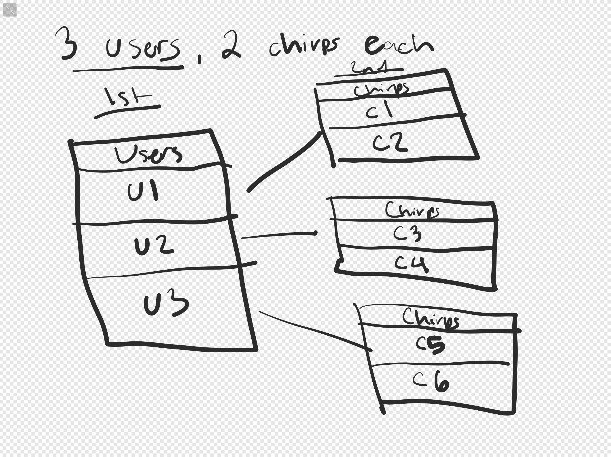

https://github.com/appacademy/sf-lecture-notes/tree/master/sql/w6d1-activerecord/demos
---
# find, find_by, all
---
# where and where.not 
---
# joins, left_outer_joins, distinct
---
# select and pluck 
---
# group 
---
# having 
---
# order offset and limit 
---
# N+1 Queries and includes 
---
## Includes 
- Does not modify the original query
- Generates a 2nd query to pre-fetch associated data
- Used as an optimization 
---
# NOT GOOD!
```ruby 
chirps = Chirp.all
# see the chirp load

chirps.each do |c|
  puts c.author.username
end
```
---
# GOOD!
```ruby 
chirps = Chirp.includes(:author).all
# see chirps load and the full user load

chirps.each do |c| # fetch is actually performed here when #each is called
  puts c.author.username
end
```
---



---
## Joins 
- Creates a single query fetching all data into a single table
- Ideally used when using aggregation on the associated data e.g. count
---
```ruby 
Chirp
  .select(:id, :body)
  .joins(:likes)
```

---


---

## Aggregated Joins
---
```ruby 
Chirp
  .select(:id, :body, "COUNT(*) as num_likes")
  .joins(:likes)
  .group(:id)
```
 
 ---

 