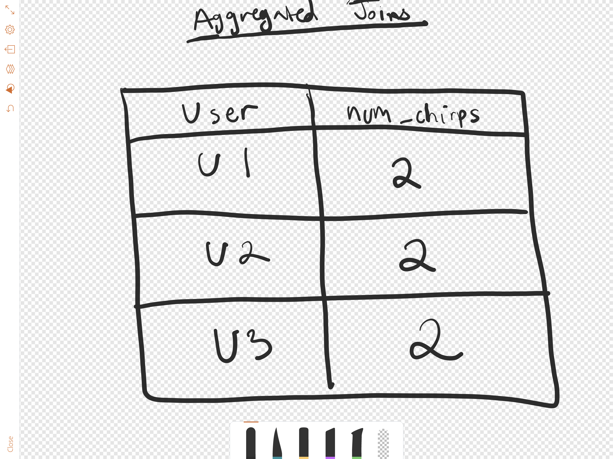

https://github.com/appacademy/sf-lecture-notes/tree/master/sql/w6d1-activerecord/demos
---
# find, find_by, all
---
# where and where.not 
---
# joins, left_outer_joins, distinct
<<<<<<< HEAD
```ruby
Chirp
    .joins(:author)
    .where(users: {username: 'Hermione Granger'})
# author is the association name
# users table, username is the column

# Find all chirps liked by people affiliated with Gryffindor
Chirp.joins(:likers).where(users: { political_affiliation: 'Gryffindor' })

# Find chirps written by 11-year olds also liked by 11-year olds 
Chirp.joins(:likers, :author).where(users: { age: 11 }).where(authors_chirps: { age: 11 })

# Find all chirps that Hermione likes 
Chirp.joins(:likers).where(users: { username: 'Hermione Granger' })

Chirp.joins(:likes, :author)

# Find all chirps with 0 likes 
Chirp.left_outer_joins(:likes).where(likes: { id: nil })
```

# select and pluck 
```ruby
Chirp.joins(:author).where(users: { username: 'Hermione Granger' } ).pluck(:body)

# select gives us an Active Relation 

# make sure to put .pluck at the end, since .pluck returns an array (not an Active Record relation)
# .where needs to work on an Active Record relation
```

# group 
```ruby
chirps = Chirp.select(:id, :body, "COUNT (*) AS NUM_LIKES").joins(:likes).group(:id)

chirps = Chirp.joins(:likes).group(:id).pluck(:id, :body, "COUNT (*) AS NUM_LIKES")
```

# having 
```ruby 
Chirp.joins(:likes).group(:id).having('COUNT (*) >= 3').pluck(:body, "COUNT (*) AS NUM_LIKES")
```

=======
---
# select and pluck 
---
# group 
---
# having 
---
>>>>>>> c0e6bb847339f76a8b8605428eb11f3e7c12fe52
# order offset and limit 
---
# N+1 Queries and includes 
---
## Includes 
- Does not modify the original query
- Generates a 2nd query to pre-fetch associated data
- Used as an optimization 
---
# NOT GOOD!
```ruby 
chirps = Chirp.all
# see the chirp load

<<<<<<< HEAD
# student challenge: find who is liking Nimbus's chirps the most 
```ruby
Chirp.select("users.username", "COUNT (*) AS num_likes" ).joins(:likers, :author).where(authors_chirps: { username: 'Nimbus'}).group("users.username").order("num_likes DESC")
```
=======
chirps.each do |c|
  puts c.author.username
end
```
---
# GOOD!
```ruby 
chirps = Chirp.includes(:author).all
# see chirps load and the full user load
>>>>>>> c0e6bb847339f76a8b8605428eb11f3e7c12fe52

chirps.each do |c| # fetch is actually performed here when #each is called
  puts c.author.username
end
```
---


---
## Joins 
- Creates a single query fetching all data into a single table
- Ideally used when using aggregation on the associated data e.g. count
---
```ruby 
Chirp
  .select(:id, :body)
  .joins(:likes)
```

---


---

## Aggregated Joins
---
```ruby 
Chirp
  .select(:id, :body, "COUNT(*) as num_likes")
  .joins(:likes)
  .group(:id)
```
 
 ---

 